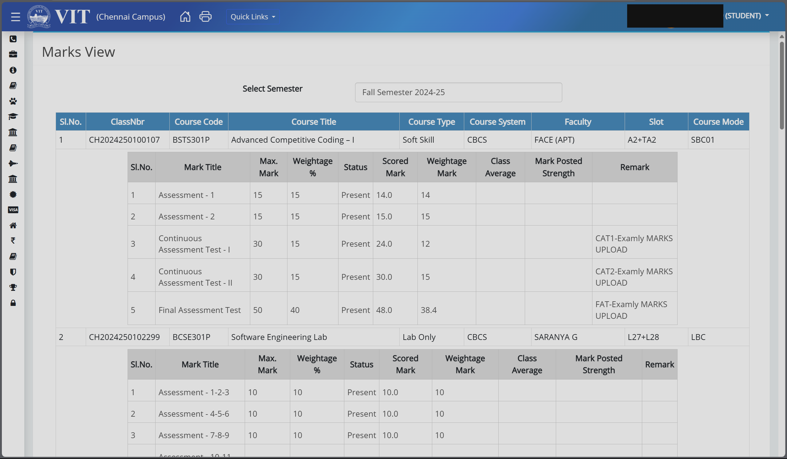
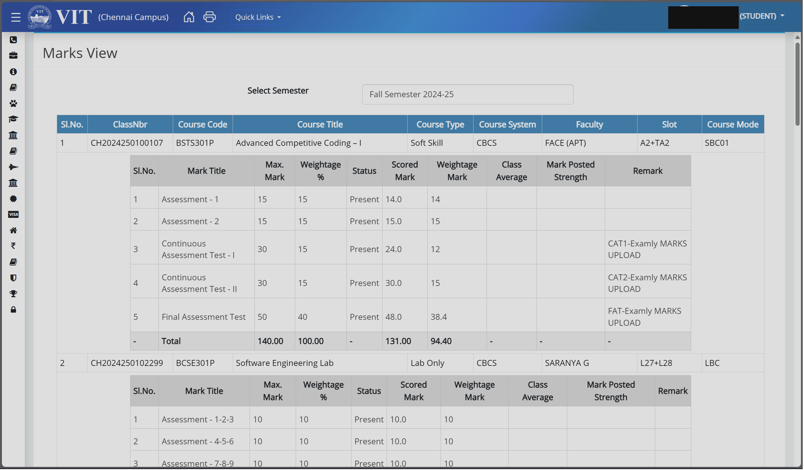
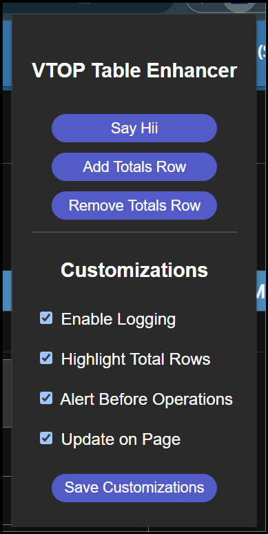

# VTOP - Marks Total Extension

## **Description:**
This is a simple chrome extension that adds the subject wise total marks of a student in `Marks` section of `VTOP - VIT Chennai Campus`.

## **Tech Stack:**
+ Manifest v3 
+ Chrome Scripting API
+ JavaScript
+ CSS
+ HTML

## **Screenshots:**
+ Before:

+ After:

+ Options:


## **How to Use the Extension:**

### **Load the Extension Manually**
You can install the extension directly by following these steps:

1. **Download the extension files**:
   - Clone this repository or download the ZIP file from the GitHub repository.
   - ```bash
     git clone https://github.com/Bbs1412/VTOP-Extension 
     ```
   - Extract the contents of the ZIP file to a folder on your computer.

2. **Open Chrome and go to the Extensions page**:
   - Enter `chrome://extensions` in the address bar and press **Enter**.

3. **Enable Developer Mode**:
   - Toggle the **Developer Mode** switch at the top-right corner of the Extensions page.

4. **Load the unpacked extension**:
   - Click on the **Load unpacked** button.
   - Select the folder containing the extracted extension files.

5. **Use the Extension**:
   - Once loaded, the extension icon will appear in the Chrome toolbar.
   - Click on the icon to open the popup and start using the extension.

### **Note**
- This method works only in Chrome or Chromium-based browsers (e.g., Edge, Brave).


## 